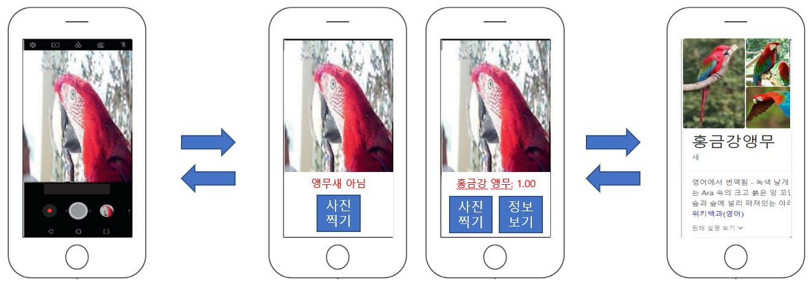
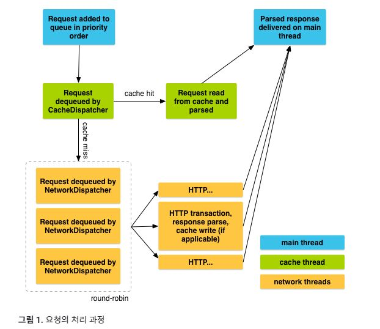

이미지 분류를 수행하는 분류 모델을 Restful한 구조로 만든다. 

1. 클라이언트 앱: 카메라로 사진을 찍어서 분석을 서버에 요청한 뒤에 분석 결과를 받아서 사용자에게 분석 결과를 포함한 결과 화면을 보여준다. 대략적으로 아래와 같은 결과 화면이 예상된다. 

   

   사용언어는 kotlin, 서버에 HTTP 요청을 할때 사용할 라이브러리는 Volley로 하기로 한다.  Volley에 대해서는 다음을 참고한다. 

   [Android Developers - Volley 개요](https://developer.android.com/training/volley/simple)

   Volley에서 요청을 처리하는 과정은 다음과 같은데 중간에 CacheDispatcher에 의해서 캐시 데이터로 요청을 처리할 수 있는지 없는지 검사하므로 Rest API의 요건 중 하나인 Cacheable을 만족한다. 
   
   
   
   카메라를 조작해 이미지를 획득하는 과정은 CameraX 라이브러리를 사용하기로 한다. CameraX를 사용하면 기존의 라이브러리보다 더 쉽게 카메라를 조작할 수 있게 된다. 
   
   [Android Developers - CameraX 개요]( https://developer.android.com/training/camerax?hl=ko)
   
   
   
2. REST 서버: 요청이 들어오면 URL에 따라 작업을 수행한다. Flask 라이브러리를 사용하여 구현한다. 여기서 최대한 기능을 분리하여 계층화하기 위해서 Tensorflow와 관련된 연산은 따로 딥러닝 연산 서버로 분리해서 실행한다. 단, Tensorflow의 딥러닝 연산 서버처럼 Scikit-learn의 모델 연산도 따로 실행할 수 있도록 분리할 것인가는 고민 중이다. 이렇게 Decoupling을 수행하면 나중에 분류 뿐만 아니라 객체 탐지도 코드의 큰 수정 없이 추가될 것으로 기대한다. 

   

3. 딥러닝 서버: Tensorflow keras를 활용해 미리 분류 모델을 훈련시키고 Tensorflow 그래프로 변환 시켜서 Tensorflow Serving API로 실행한다. 

개발 환경은 Docker에서 수행한다. Docker 환경에서 개발하면 원래 Ubuntu 환경을 최대한 건드리지 않아도 되고, 나중에 Migration 할때도 편해질 수 있다. 

