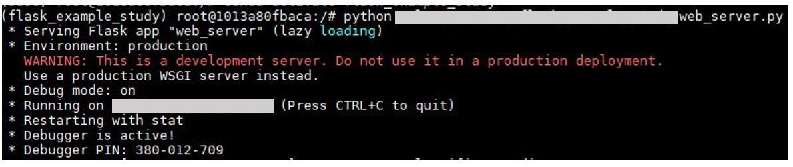
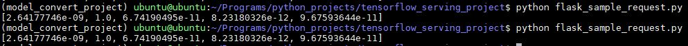
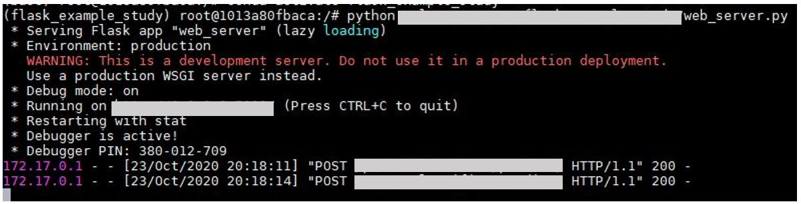

REST 서버를 구축하기 위해서 Flask 라이브러리를 사용한다. 요청으로 들어온 데이터를 딥 러닝 서버 URL로 분석을 요청한다. 결과를 응답받으면 이를 Json 문자열 형태로 Serialize해서 클라이언트에 결과를 보낸다. 

```python 
import base64
import json
import requests
import numpy as np
from io import BytesIO
from flask import Flask, request, jsonify
from tensorflow.keras.preprocessing import image

app = Flask(__name__)

#라우팅 룰 추가. 
@app.route(라우팅룰, methods=['POST'])
def parrot_classifier():
    #b64라는 키값으로 Serialize된 데이터를 가져와서 이미지의 픽셀 배열로 만든다.
    img = image.img_to_array(image.load_img(BytesIO(base64.b64decode(request.form['b64'])),
                                            target_size=(299, 299)))/255.
    img = img.astype('float16')
    
    #딥러닝 서버로 이미지 분석을 위한 Json표현의 데이터 생성
    payload = {
      "instances": [img.tolist()]
    }
    
    #딥러닝 서버로 분석 요청하고 응답 받음
    r = requests.post(URL, json=payload)
    pred = json.loads(r.content.decode('utf-8'))
    
    #응답 받은 결과를 클라이언트로 리턴하기 위해서 Json형태로 Serialization
    return json.dumps(np.array(pred['predictions'])[0].tolist())


if __name__ == "__main__":
    app.run(host=호스트IP, port=포트번호, threaded=False, debug=True)
    #실제로는debug모드OFF할것
```

- python server.py와 같은 방식으로 실행시킨다.




아래의 코드는 테스트 코드

```python 
import base64
import requests

API_ENDPOINT = REST서버쪽으로보내는요청URL

image_path = 이미지경로
b64_image = ''
with open(image_path, 'rb') as imageFile:
  b64_image = base64.b64encode(imageFile.read())

data = {'b64': b64_image}

#서버로 요청
r = requests.post(url=API_ENDPOINT, data=data)

#응답 결과 출력
print(r.text)
```






주의할 점:

Debug 모드를 켜놓으면 코드가 달라질때 자동으로 감지하기 때문에 REST서버를 껐다가 켰다할 필요가 없다. 하지만 의도치 않게 꺼졌을 경우 ps -fA | grep python으로 서버를 강제 종료 시켜 잡고 있는 포트를 놓게 해야한다. 