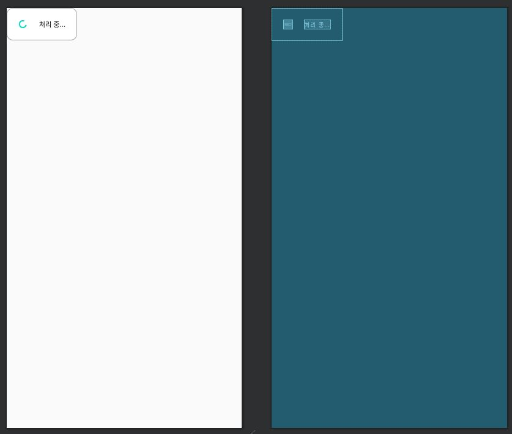

```xml 
<?xml version="1.0" encoding="utf-8"?>


<shape xmlns:android="http://schemas.android.com/apk/res/android"
    android:shape="rectangle">
    <!-- you can use any color you want I used here gray color-->

    <stroke
        android:width="1dp"
        android:color="@android:color/darker_gray" />

    <solid
        android:color="@android:color/white"/>
    <corners
        android:radius="10dp"/>
</shape>

res/drawable/rect_message.xml로 처리중... 이라는 다이얼로그의 바탕이 되는 흰색 사각형이다. 
```

```xml 
<?xml version="1.0" encoding="utf-8"?>
<androidx.constraintlayout.widget.ConstraintLayout xmlns:android="http://schemas.android.com/apk/res/android"
    xmlns:app="http://schemas.android.com/apk/res-auto"
    xmlns:tools="http://schemas.android.com/tools" android:background="@drawable/rect_message"
    android:layout_width="wrap_content"
    android:layout_height="wrap_content">

    <ProgressBar android:layout_width="wrap_content" android:layout_height="wrap_content"
        app:layout_constraintTop_toTopOf="parent" app:layout_constraintStart_toStartOf="parent"
        style="?android:attr/progressBarStyleSmall"
        app:layout_constraintBottom_toBottomOf="parent" android:layout_marginTop="20dp"
        android:layout_marginStart="20dp" android:layout_marginBottom="20dp" android:id="@+id/progressBar2"/>
    <TextView
        android:text="처리 중..."
        android:layout_width="wrap_content"
        android:textSize="12dp"
        android:layout_height="wrap_content"
        android:gravity="center"
        app:layout_constraintTop_toTopOf="@+id/progressBar2"
        app:layout_constraintBottom_toBottomOf="@+id/progressBar2"
        app:layout_constraintStart_toEndOf="@+id/progressBar2" android:layout_marginStart="20dp"
        app:layout_constraintEnd_toEndOf="parent" android:layout_marginEnd="20dp"
        android:textColor="@android:color/black"/>

</androidx.constraintlayout.widget.ConstraintLayout>

res/layout/dialog_loading.xml로 처리중... 다이얼로그의 레이아웃. 안드로이드에서 기본으로 제공하는 progressBarStyleSmall을 사용해서 ProgressBar를 만들고 그 옆에 처리 중... 이라는 글씨를 보이기 위해서 Textview를 만들었다. 
```

```kotlin 
package com.example.cameraxapp

import android.app.Dialog
import android.content.Context
import android.graphics.Color
import android.graphics.drawable.ColorDrawable

class LoadingDialog
    constructor(context: Context) : Dialog(context){

    init {
        setCanceledOnTouchOutside(false)

        window!!.setBackgroundDrawable(ColorDrawable(Color.TRANSPARENT))

        setContentView(R.layout.dialog_loading)
    }
}

Dialog를 상속 받는 커스텀 다이얼로그인 LoadingDialog를 만들었다. setCanceledOnTouchOutside(false)로 다이얼로그 외부를 터치해도 다이얼로그가 종료되지 않도록 하고 window!!.setBackgroundDrawable(ColorDrawable(Color.TRANSPARENT))로 다이얼로그 이외의 배경이 투명해지도록 한다.
```

```kotlin 
implementation 'org.jetbrains.kotlinx:kotlinx-coroutines-android:1.3.3'

kotlin의 Coroutine을 통해서 다이얼로그와 Flask서버로 보내는 요청 코드가 Not-blocking으로 동시적으로 실행될 수 있도록 할 것이다. Coroutine을 사용하기 위한 Dependency를  build.gradle (Module: app)에 추가해준다. 
```

```kotlin 
private fun takePhoto() {
        // Get a stable reference of the modifiable image capture use case
        val imageCapture = imageCapture ?: return
        val dialog: Dialog = LoadingDialog(this)

        CoroutineScope(Dispatchers.Main).launch {
            dialog.show()
            imageCapture.takePicture(
                ... 
                override fun onCaptureSuccess(image: ImageProxy) {
                    ...
                    val stringRequest: StringRequest = object : StringRequest(Method.POST, url,
                            Response.Listener { response ->
                                try {
                                    ...
                                    val fileStream = this@MainActivity.openFileOutput(fileName, Context.MODE_PRIVATE)
                                    bitmapImage.compress(Bitmap.CompressFormat.JPEG, 100, fileStream)
                                    fileStream.close()
                                    bitmapImage.recycle()
                                    val intent = Intent(this@MainActivity, ResultActivity::class.java).apply {
                                        putExtra("image", fileName)
                                        putExtra("result", response)
                                    }
                                    dialog.dismiss()
                                    startActivity(intent)

지난번에 설명한 코드는 6을 참조. 
```

```kotlin 
val dialog: Dialog = LoadingDialog(this)

위에서 미리 정의해둔 커스텀 다이얼로그 객체를 생성한다.
```

```kotlin 
CoroutineScope(Dispatchers.Main).launch {
            dialog.show()
    
CoroutineScope(Dispatchers.Main).launch 이하의 영역을 동시적으로 실행할 수 있게 한다. 여기서 다이얼로그를 보여주는 코드와 끄는 코드, 요청을 보내고 받고 결과 화면 액티비티로 전환하는 코드를 수행한다.
```

```kotlin 
dialog.dismiss()
startActivity(intent)

요청에 대한 응답을 받아서 인텐트를 생성한 뒤에 다른 액티비티로 전환하기 전에 다이얼로그를 끈다. 
```





다음을 참조했다. 

[허접샴푸로그래밍 - 안드로이드 Kotlin으로 Custom Loading Dialog(커스텀 로딩 다이얼로그) 구현하기](https://programmar.tistory.com/20)

