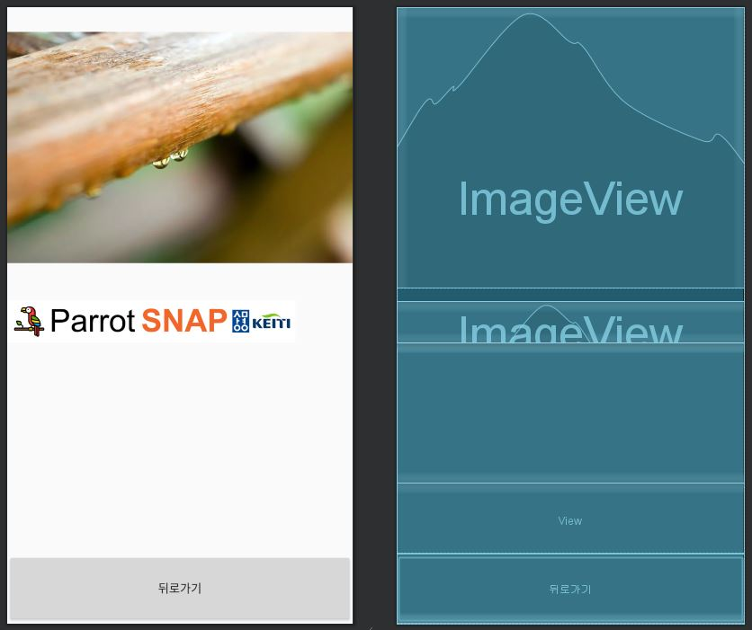

```kotlin 
package com.example.cameraxapp

import android.content.Context
import android.content.Intent
import android.graphics.Bitmap
import android.graphics.BitmapFactory
import android.graphics.Color
import android.graphics.Typeface
import android.os.Bundle
import android.util.AttributeSet
import android.view.Gravity
import android.view.MotionEvent
import android.view.ViewGroup
import android.widget.LinearLayout
import android.widget.TextView
import androidx.appcompat.app.AppCompatActivity
import androidx.appcompat.widget.AppCompatTextView
import kotlinx.android.synthetic.main.activity_result.*
import java.io.FileInputStream
import java.text.DecimalFormat


class ResultActivity : AppCompatActivity() {

    override fun onCreate(savedInstanceState: Bundle?) {
        super.onCreate(savedInstanceState)
        setContentView(R.layout.activity_result)

        val filename = intent.getStringExtra("image")
        val result = intent.getStringExtra("result")
        initialize(filename, result)
        backButton.setOnClickListener {
            finish()
        }
    }

    private fun initialize(mfilename: String, mresult: String){
        val filename: String = mfilename
        val result: String = mresult

        val open: FileInputStream  = this.openFileInput(filename)
        val bmp: Bitmap = BitmapFactory.decodeStream(open)
        open.close()

        imageView.setImageBitmap(bmp)

        val params: LinearLayout.LayoutParams = LinearLayout.LayoutParams(
            LinearLayout.LayoutParams.MATCH_PARENT,
            200
        )
        val viewParams: LinearLayout.LayoutParams = LinearLayout.LayoutParams(
            550,
            ViewGroup.LayoutParams.MATCH_PARENT
        )

        list_item!!.removeAllViews()
        if (result == "Not parrot"){
            val noParrot = TextView(this)
            noParrot.setBackgroundColor(Color.parseColor("#2198F6"))
            noParrot.text = result
            noParrot.textSize = 20.0.toFloat()
            noParrot.setTypeface(null, Typeface.BOLD)
            noParrot.setTextColor(Color.WHITE)
            noParrot.gravity = Gravity.CENTER
            noParrot.layoutParams = params
            list_item.addView(noParrot)
        } else {
            val subString = result!!.substring(1, result!!.length-1)
            val probabilitiesString = subString.split(",")
            val probabilities = mutableListOf<Float>()
            probabilitiesString.forEach {
                probabilities.add(DecimalFormat("0.0000").format(it.toFloat()).toFloat())
            }
            val maxIndex = probabilities.indexOf(probabilities.max())
            val labels= application.assets.open("labels.txt").bufferedReader().use{
                it.readText().trim()
            }
            val splittedLabels = labels.split("\n")

            for (idx in splittedLabels.indices){
                if (idx == maxIndex){
                    val linearLayout = LinearLayout(this)
                    linearLayout.orientation = LinearLayout.HORIZONTAL
                    linearLayout.layoutParams = params
                    linearLayout.setBackgroundColor(Color.parseColor("#2198F6"))

                    val className = CustomTextView(this)
                    className.setString(splittedLabels[idx])
                    className.text = splittedLabels[idx]
                    className.gravity = Gravity.CENTER
                    className.layoutParams = viewParams
                    className.textSize = 20.0.toFloat()
                    className.setTypeface(null, Typeface.BOLD)
                    className.setTextColor(Color.WHITE)

                    val probability = TextView(this)
                    probability.text = "${probabilities[idx]}"
                    probability.setTextColor(Color.WHITE)
                    probability.gravity = Gravity.CENTER
                    probability.textSize = 20.0.toFloat()
                    probability.setTypeface(null, Typeface.BOLD)
                    probability.layoutParams = viewParams

                    linearLayout.addView(className)
                    linearLayout.addView(probability)
                    list_item.addView(linearLayout)
                } else {
                    val linearLayout = LinearLayout(this)
                    linearLayout.orientation = LinearLayout.HORIZONTAL
                    linearLayout.layoutParams = params
                    linearLayout.setBackgroundColor(Color.parseColor("#2198F6"))

                    val className = TextView(this)
                    className.text = splittedLabels[idx]
                    className.setTypeface(null, Typeface.BOLD)
                    className.setTextColor(Color.parseColor("#EEE1972A"))
                    className.gravity = Gravity.CENTER
                    className.layoutParams = viewParams

                    val probability = TextView(this)
                    probability.text = "${probabilities[idx]}"
                    probability.setTypeface(null, Typeface.BOLD)
                    probability.setTextColor(Color.parseColor("#EEE1972A"))
                    probability.gravity = Gravity.CENTER
                    probability.layoutParams = viewParams

                    linearLayout.addView(className)
                    linearLayout.addView(probability)
                    list_item.addView(linearLayout)
                }
            }
        }
    }
}

class CustomTextView : AppCompatTextView {
    private var str: String? = null

    constructor(context: Context) : super(context) {}
    constructor(context: Context, attrs: AttributeSet?) : super(context, attrs) {}

    override fun onTouchEvent(event: MotionEvent): Boolean {
        super.onTouchEvent(event)
        when (event.action) {
            MotionEvent.ACTION_DOWN -> return true
            MotionEvent.ACTION_UP -> {
                performClick()
                return true
            }
        }
        return false
    }

    override fun performClick(): Boolean {
        super.performClick()
        showInformation()
        return true
    }

    fun setString(string: String){
        str = string
    }

    private fun showInformation() {
        val intent = Intent(context, InformationActivity::class.java).apply {
            putExtra("name", str)
        }
        context.startActivity(intent)
    }
}
```

```kotlin 
val filename = intent.getStringExtra("image")
val result = intent.getStringExtra("result")

이미지를 캡처하는 액티비티에서 보내온 캡처된 이미지의 이름과 Flask 서버에서의 응답 결과를 가져온다. 
```

```kotlin 
initialize(filename, result)
backButton.setOnClickListener {
      finish()
}

저장된 이미지를 ImageView로 보여주고 동적으로 결과에 대한 TextView를 추가할 initialize를 호출한다. 
돌아가기 버튼을 누르면 이미지 캡처 하는 액티비티로 돌아갈 수 있게 한다. 
```

```kotlin 
private fun initialize(mfilename: String, mresult: String){
    val filename: String = mfilename
    val result: String = mresult

    val open: FileInputStream  = this.openFileInput(filename)
    val bmp: Bitmap = BitmapFactory.decodeStream(open)
    open.close()

    imageView.setImageBitmap(bmp)
    
비트맵 이미지를 불러와서 ImageView에 셋팅한다. 
```

```kotlin 
val params: LinearLayout.LayoutParams = LinearLayout.LayoutParams(
    LinearLayout.LayoutParams.MATCH_PARENT,
    200
)
val viewParams: LinearLayout.LayoutParams = LinearLayout.LayoutParams(
    550,
    ViewGroup.LayoutParams.MATCH_PARENT
)
list_item!!.removeAllViews()

params는 스크롤뷰에 동적으로 추가되는, 앵무새 이름과 확률값을 각각 보여주는 두 개의 TextView를 자식으로 두는 LinearLayout에 대한 속성 값의 일부를 정의한다. viewParams은 결과를 보여주는 TextView에 대한 속성 값의 일부를 정의한다. 첫 번째 인자는 width, 두 번째 인자는 height. 
스크롤뷰 안에 동적으로 추가되는 LinearLayout들의 부모 LinearLayout인 list_item에 모든 뷰가 있다면 제거하여 정리한다. 
```

```kotlin 
if (result == "Not parrot"){
    val noParrot = TextView(this)
    noParrot.setBackgroundColor(Color.parseColor("#2198F6"))
    noParrot.text = result
    noParrot.textSize = 20.0.toFloat()
    noParrot.setTypeface(null, Typeface.BOLD)
    noParrot.setTextColor(Color.WHITE)
    noParrot.gravity = Gravity.CENTER
    noParrot.layoutParams = params
    list_item.addView(noParrot)
}

응답이 Not parrot이라면 이에 대한 TextView를 만들어서 list_item에 추가한다. 
```

```kotlin 
else {
    val subString = result!!.substring(1, result!!.length-1)
    val probabilitiesString = subString.split(",")
    val probabilities = mutableListOf<Float>()
    probabilitiesString.forEach {
        probabilities.add(DecimalFormat("0.0000").format(it.toFloat()).toFloat())
    }
    val maxIndex = probabilities.indexOf(probabilities.max())
    val labels= application.assets.open("labels.txt").bufferedReader().use{
        it.readText().trim()
    }
    val splittedLabels = labels.split("\n")
    
응답이 Not parrot이 아니라면 [1.0, 0.0, ...] 이런식의 문자열이 있을텐데 braces를 제거하기 위해서 서브스트링을 추출하고 ","로 split 한다음에 각 확률 값을 부동 소수점 표현 방식에서 고정 소수점 표현 방식으로 바꿔서 probabilities에 저장한다. 그 중에서 가장 큰 값의 인덱스를 구해 놓는다. 
labels.txt에 클래스들이 여러 줄로 적혀 있는데 이를 읽어와서 "\n"로 split해서 저장한다. -> 서버에서 리턴하는 방식으로 바꿔야 할듯.
```

```kotlin 
for (idx in splittedLabels.indices){
    if (idx == maxIndex){
        val linearLayout = LinearLayout(this)
        linearLayout.orientation = LinearLayout.HORIZONTAL
        linearLayout.layoutParams = params
        linearLayout.setBackgroundColor(Color.parseColor("#2198F6"))

        val className = CustomTextView(this)
        className.setString(splittedLabels[idx])
        className.text = splittedLabels[idx]
        className.gravity = Gravity.CENTER
        className.layoutParams = viewParams
        className.textSize = 20.0.toFloat()
        className.setTypeface(null, Typeface.BOLD)
        className.setTextColor(Color.WHITE)

        val probability = TextView(this)
        probability.text = "${probabilities[idx]}"
        probability.setTextColor(Color.WHITE)
        probability.gravity = Gravity.CENTER
        probability.textSize = 20.0.toFloat()
        probability.setTypeface(null, Typeface.BOLD)
        probability.layoutParams = viewParams

        linearLayout.addView(className)
        linearLayout.addView(probability)
        list_item.addView(linearLayout)
    } else {
        val linearLayout = LinearLayout(this)
        linearLayout.orientation = LinearLayout.HORIZONTAL
        linearLayout.layoutParams = params
        linearLayout.setBackgroundColor(Color.parseColor("#2198F6"))

        val className = TextView(this)
        className.text = splittedLabels[idx]
        className.setTypeface(null, Typeface.BOLD)
        className.setTextColor(Color.parseColor("#EEE1972A"))
        className.gravity = Gravity.CENTER
        className.layoutParams = viewParams

        val probability = TextView(this)
        probability.text = "${probabilities[idx]}"
        probability.setTypeface(null, Typeface.BOLD)
        probability.setTextColor(Color.parseColor("#EEE1972A"))
        probability.gravity = Gravity.CENTER
        probability.layoutParams = viewParams

        linearLayout.addView(className)
        linearLayout.addView(probability)
        list_item.addView(linearLayout)
    }
}

만약에 인덱스가 maxIndex라면 글씨 크기를 키우고 클래스 이름을 눌렀을때 WebView를 포함하고 있는 액티비티로 넘어갈 수 있도록 onTouchEvent를 정의한 커스텀 TextView를 생성한다. 나머지는 클래스와 이름을 보여주는 TextView를 생성하고 이들을 포함하는 LinearLayout도 만들어서 list_item에 추가한다. 
```

```kotiln 
class CustomTextView : AppCompatTextView {
    private var str: String? = null

    constructor(context: Context) : super(context) {}
    constructor(context: Context, attrs: AttributeSet?) : super(context, attrs) {}

    override fun onTouchEvent(event: MotionEvent): Boolean {
        super.onTouchEvent(event)
        when (event.action) {
            MotionEvent.ACTION_DOWN -> return true
            MotionEvent.ACTION_UP -> {
                performClick()
                return true
            }
        }
        return false
    }

    override fun performClick(): Boolean {
        super.performClick()
        showInformation()
        return true
    }

    fun setString(string: String){
        str = string
    }

    private fun showInformation() {
        val intent = Intent(context, InformationActivity::class.java).apply {
            putExtra("name", str)
        }
        context.startActivity(intent)
    }
}

TextView에 손을 눌렀다 땠을때 WebView를 포함하고 있는 액티비티로 넘어갈 수 있게 한다(이에 대해서 어떤 스택오버플로우 답변을 참고했는데 다시 찾을수가 없다).
```


