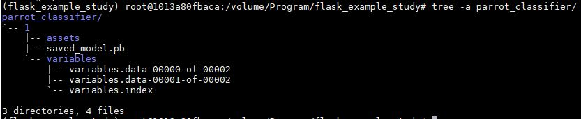
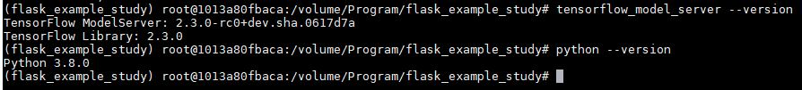
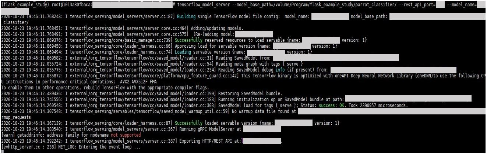
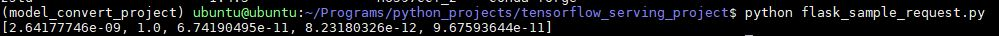

REST 서버나 딥 러닝 서버를 구성할 때는 다음을 참고했다. 

[Himanshu Rawlani - Deploying Keras models using TensorFlow Serving and Flask]( https://towardsdatascience.com/deploying-keras-models-using-tensorflow-serving-and-flask-508ba00f1037)

모델은 Anaconda의 Jupyter Notebook 환경에서 생성했다. Tensorflow-gpu 버전은 2.2.0버전이다. 

Tensorflow-gpu를 활용하기 위한 Docker 환경 구축은 다음을 참고했다. 주의할 점은 Jupyter Notebook을 실행시키기위한 포트포워딩 설정을 해야 한다는 것이다. 이것은 Docker Image을 run 명령어로 컨테이너를 빌드할때 옵션으로 설정할 수 있다. 또, 호스트 OS와 데이터 공유를 위해서 공유 Volume을 만들었다. 

[Tensorflow-Docker](https://www.tensorflow.org/install/docker?hl=ko)

Docker환경으로 Jupyter Notebook를 사용하기 위한 환경을 구축한 뒤에 Docker 내에서 Jupyter Notebook를 실행하기 위한 명령어는 다음과 같다.

- jupyter notebook --ip=ip주소 --port=포트번호 --allow-root

단 이 환경에서는 웹 브라우저가 설치되어 있지 않으므로 하나의 터미널을 더 열어서 FifeFox로 접속한다. 


아래의 코드로 전이 학습 모델을 훈련시키고 텐서플로우 그래프를 생성한다. 

```python 
from tensorflow.keras.callbacks import EarlyStopping, ReduceLROnPlateau
from tensorflow.keras.preprocessing.image import ImageDataGenerator
from tensorflow.keras.layers import Dense, GlobalAveragePooling2D
from tensorflow.keras.models import Sequential
from tensorflow.keras.optimizers import Adam

from tensorflow.keras.applications import MobileNetV2

from sklearn.metrics import confusion_matrix
from sklearn.metrics import classification_report

import tensorflow as tf

import numpy as np

%matplotlib inline
import matplotlib.pyplot as plt

seed = 7
np.random.seed(seed)
 
batch_size = 24  

#이미지데이터셋을 배치 단위로 읽어들이는 제너레이터 생성
train_dir = 훈련셋폴더경로
valid_dir = 검증셋폴더경로

train_datagen = ImageDataGenerator(rescale=1./255)
valid_datagen = ImageDataGenerator(rescale=1./255)

train_generator = train_datagen.flow_from_directory(
    train_dir,
    target_size=(299, 299),
    batch_size=batch_size,
    class_mode='categorical',
    shuffle=True) 

validation_generator = valid_datagen.flow_from_directory(
    valid_dir, 
    target_size=(299, 299),
    batch_size=batch_size,
    class_mode='categorical',
    shuffle=True) 

# 모델 훈련시 적용가능한 콜백함수 생성 여기서는
# 훈련 간에 모델 성능이 개선되지 않을때 훈련을 조기 종료 시키는 콜백함수와
# 일정 시간 기간만큼 성능이 정체되어 있으면 Learning Rate를 조절하는 콜백함수를 사용.
callbacks_list = [
        EarlyStopping(monitor='val_acc', patience=5),
        ReduceLROnPlateau(monitor='val_acc', factor=0.03, patience=3)
    ]

# 전이 학습을 위한 ImageNet 데이터셋으로 Pretrained된 모델로는 MobileNetV2 사용.
# 차후 추가적으로 서버-클라이언트 구조가 아니라 네이티브앱으로 구현하는 것을 고려.
# 모델의 용량을 최대한 줄이면서 과적합을 방지하기 위해서 GlobalAveragePooling 사용.
# GlobalAveragePooling에 대해서는 Network In Network 논문 참조.
name = "MobileNetV2"
mirrored_strategy = tf.distribute.MirroredStrategy()
with mirrored_strategy.scope():
    base_model = MobileNetV2(weights='imagenet', include_top=False, 
                             input_tensor=tf.keras.layers.Input(shape=(299, 299, 3), name='image_input'))
    model = Sequential()
    model.add(base_model)
    model.add(GlobalAveragePooling2D())
    model.add(Dense(5, activation='softmax'))
    model.compile(loss='categorical_crossentropy', metrics=['acc'],
              optimizer=Adam(lr=1e-3))
    
hist = model.fit(
    train_generator,
    steps_per_epoch = train_generator.samples // batch_size,
    validation_data = validation_generator, 
    validation_steps = validation_generator.samples // batch_size,
    callbacks=callbacks_list,
    epochs = 100)

#Tensorflow 최근 버전은 모델을 저장할때 h5를 명시하지 않으면 SavedModel형식으로 
#자동으로 모델을 Tensorflow 그래프로 저장하고 관련 Variable을 관리함.
model.save('./result/parrot_classifier/1')

# 구버전 Tensorflow 버전에서 Tensorflow 그래프를 생성하기 위한 코드
# export_path = './result/parrot_classifier/1'
# sess = tf.compat.v1.keras.backend.get_session()
# tf.compat.v1.saved_model.simple_save(
#     sess,
#     export_path,
#     inputs={'input_image': model.layers[0].input},
#     outputs={t.name: t for t in model.outputs})

# 훈련 Loss, Accuracy를 그래프로 확인하기 위한 코드
# fig, axes = plt.subplots(2)

# twin_axes_ax = np.array((axes[0].twinx(), axes[1].twinx()))
# axes[0].plot(hist.history['loss'], 'y', label='train loss')
# axes[1].plot( hist.history['acc'], 'b', label='train acc')
# twin_axes_ax[0].plot(hist.history['val_loss'], 'r', label='val loss')
# twin_axes_ax[1].plot(hist.history['val_acc'], 'g', label='val acc')
# axes[1].set_xlabel('epoch')
# axes[0].set_ylabel('loss')
# axes[1].set_ylabel('accuray')
# axes[0].legend(loc='upper right')
# twin_axes_ax[0].legend(loc='center right')
# axes[1].legend(loc='center right')
# twin_axes_ax[1].legend(loc='lower right')
# plt.show()
# print("-------------\n\n")
# print("{0}.\n\n".format(name))

# 훈련된 모델을 테스트하기 위한 테스트 제너레이터 생성 코드.
# test_dir = 테스트데이터폴더경로
# test_datagen = ImageDataGenerator(rescale=1./255)
# test_generator = test_datagen.flow_from_directory(
#     test_dir,
#     target_size=(224, 224), 
#     batch_size=batch_size,
#     shuffle=False,
#     class_mode='categorical') 

# 제너레이터에서 테스트이미지의 레이블만 추출.
# outputs = np.zeros((test_generator.samples, test_generator[0][1].shape[1]), dtype='float32')
# for i, (inputs, output) in enumerate(test_generator):
#     outputs[i] = output
#     if i >= test_generator.samples-1:
#         break

# 예측 값과 레이블의 Confusion Matrix, Precision, Recall, F1-Score 등을 확인.
# yhat = model.predict(test_generator, steps=test_generator.samples // batch_size)
# yhat_indexes = np.argmax(yhat, axis=1)
# test_indexes = np.argmax(outputs, axis=1)
# print("Confusion matrix : ")
# print(confusion_matrix(test_indexes, yhat_indexes)) 
# print("\n\n")
# print("Classification report : ")
# print(classification_report(test_indexes, yhat_indexes)) 
# print("\n\n\n")
```




터미널에서 아래 명령어를 실행시켜서 Tensorflow-Serving-API를 사용하기 위한 tensorflow-model-server를 설치한다. 단 Docker 환경에서는 Root 계정으로 작업을 수행했기 때문에 sudo 명령어를 모두 제거한다. 

```Linux
$ apt install curl

$ echo "deb [arch=amd64] http://storage.googleapis.com/tensorflow-serving-apt stable tensorflow-model-server tensorflow-model-server-universal" | tee /etc/apt/sources.list.d/tensorflow-serving.list && curl https://storage.googleapis.com/tensorflow-serving-apt/tensorflow-serving.release.pub.gpg | apt-key add -

$ apt-get update

$ apt-get install tensorflow-model-server
```



tensorflow-model-server를 업그레이드 하려면 다음의 명령어를 수행한다.

``````Linux
$ apt-get upgrade tensorflow-model-server
``````

Tensorflow Serving API로 딥러닝 서버를 시작하려면 다음의 명령어를 수행한다.

```Linux 
$ tensorflow_model_server --model_base_path=텐서플로우그래프폴더경로(절대경로) --rest_api_port=서비스포트 --model_name=모델이름(URL에표시될모델이름)
```



테스트하기위한 요청 코드는 다음과 같다.

```python 
import json

import numpy as np
import requests
from keras.preprocessing import image

image_path = 이미지경로

# 이미지를 불러와서 픽셀 배열로 바꾸고 255로 나누어 전처리하는 코드
img = image.img_to_array(image.load_img(image_path, target_size=(299, 299))) / 255.

# 각 픽셀 값의 타입을 float16으로 바꾸는 코드
img = img.astype('float16')

# 분석을 요청하기 위해서 URL과 함께 보내는 데이터 생성 코드. 
# 파이썬 Dictionary는 Json과 Compatible함.
payload = {
    "instances": [img.tolist()]
}

#요청하고 응답받는 코드
r = requests.post(URL, json=payload)
pred = json.loads(r.content.decode('utf-8'))
print(np.array(pred['predictions'])[0])
```




주의할점:

Jupyter Notebook이나 Tensorflow Serving API로 리눅스 쉘에서 프로그램을 시작했다가 껐다가 하면 오류가 뜰때가 있는데 ps -fA | python 혹은 tensorflow 명령어로 검색해보면 껐음에도 불구하고 포트를 붙잡고 있을때가 있는데 이때 kill -9 포트번호로 종료시킨다. 