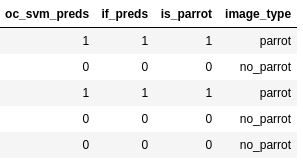
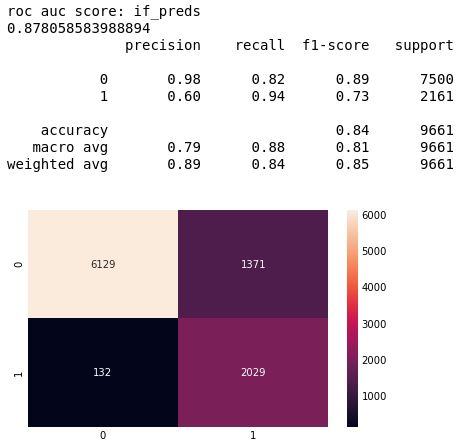
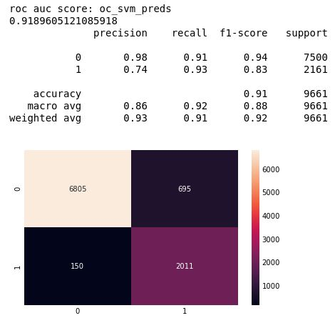
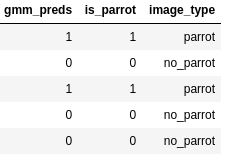
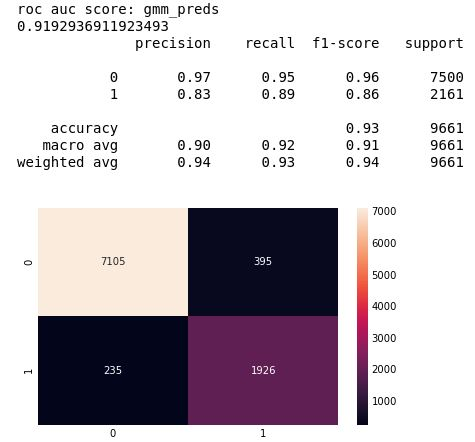
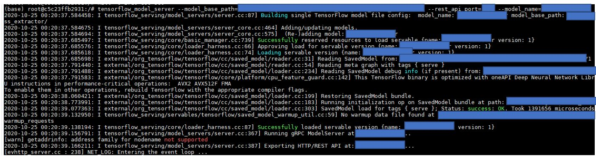
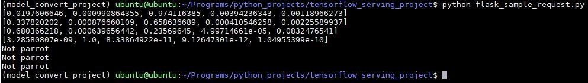
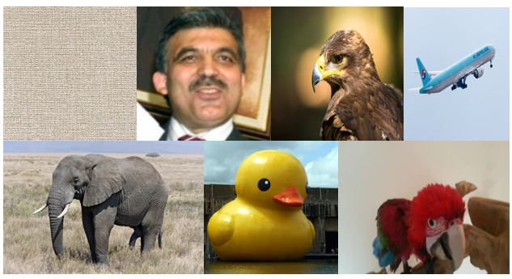

One class classification과 관련된 자료는 다음을 참조했다. 

[Sean Guntvedt - One Class Classification for Images]( https://www.kaggle.com/paperboiii/one-class-classification-for-images)

1. 먼저 Unsupervised Learning에서 특징을 추출할 데이터와 검증, 테스트용 데이터를 로드 한 뒤에ImageNet 데이터셋으로 미리 훈련된 ResNet50 모델을 불러온다. 
2. Train, Validation, Test 데이터로 Pretrained된 모델에서 특징을 추출한 뒤에 Z-score 표준화를 수행하고나서 PCA로 주요 특징을 추출해낸다. 
3. 그리고 나서 각 One class Classification 모델을 훈련시킨뒤에 PCA로 뽑아낸 특징들을 바탕으로 테스트를 수행한다. 
4. 가장 성능이 좋은 모델을 저장하고 나서 REST 서버에서 로드 한 뒤에 One class classification을 수행한다.  이때 ResNet50은 Tensorflow Serving API로 작업을 수행하고 Unsupervised Learning으로 학습시킨 One class classification 모델은 REST 서버에서 joblib 파일 형태를 불러온다. 


```python 
import os
import numpy as np
import pandas as pd
import seaborn as sns
import matplotlib.pyplot as plt
plt.style.use('fivethirtyeight')
%matplotlib inline

from tensorflow.compat.v1.keras.applications.resnet50 import preprocess_input
from tensorflow.keras.preprocessing.image import load_img, img_to_array
from tensorflow.keras.applications import ResNet50

from sklearn.model_selection import train_test_split
from sklearn.utils import shuffle
from sklearn.preprocessing import StandardScaler
from sklearn.decomposition import PCA
from sklearn.svm import OneClassSVM
from sklearn.ensemble import IsolationForest
from sklearn.metrics import roc_auc_score, classification_report, confusion_matrix
from sklearn.mixture import GaussianMixture
from sklearn.isotonic import IsotonicRegression

#앵무새 데이터 로드
train_img_dir_n = 앵무새 이미지 폴더 경로
train_img_paths_n = [os.path.join(train_img_dir_n,filename) for filename in os.listdir(train_img_dir_n)]

#데이터를 나눈다. 개수는 (Train, Valid, Test)->(4860, 1620, 2161)
train_img_paths, test_img_paths_parrot = train_test_split(train_img_paths_n, test_size=0.25, random_state=42)
train_img_paths, val_img_paths_parrot = train_test_split(train_img_paths, test_size=0.25, random_state=42)

#비앵무새 데이터 로드
no_parrot_img_n = 비 앵무새 이미지 폴더 경로
no_parrot_img_paths_n = [os.path.join(no_parrot_img_n,filename) for filename in os.listdir(no_parrot_img_n)]

#데이터를 나눈다. 개수는 (Valid, Test)->(2500, 7500)
test_img_paths_no_parrot, val_img_paths_no_parrot = train_test_split(no_parrot_img_paths_n, test_size = 0.25, random_state = 42)

#테스트 데이터 비중을 알아보기 위한 작업
def img_type(is_parrot):
    if is_parrot:
        return 'parrot'
    else:
        return 'no_parrot'
all_test_paths = test_img_paths_parrot+test_img_paths_no_parrot
test_path_df = pd.DataFrame({
    'path': all_test_paths,
    'is_parrot': [1 if path in test_img_paths_parrot else 0 for path in all_test_paths]
})
test_path_df = shuffle(test_path_df,random_state = 0).reset_index(drop = True)
test_path_df['image_type'] = test_path_df['is_parrot'].apply(lambda x: img_type(x))
all_test_paths = test_path_df['path'].tolist()


print('Distribution of Image Types in Test Set')
print(test_path_df['image_type'].value_counts())

(
Distribution of Image Types in Test Set
no_parrot    7500
parrot       2161
Name: image_type, dtype: int64
)

#검증 데이터 비중을 알아보기 위한 작업
all_val_paths = val_img_paths_parrot+val_img_paths_no_parrot
val_path_df = pd.DataFrame({
    'path': all_val_paths,
    'is_parrot': [1 if path in val_img_paths_parrot else 0 for path in all_val_paths]
})
val_path_df = shuffle(val_path_df,random_state = 0).reset_index(drop = True)
val_path_df['image_type'] = val_path_df['is_parrot'].apply(lambda x: img_type(x))
all_val_paths = val_path_df['path'].tolist()

print('Distribution of Image Types in Validation Set')
print(val_path_df['image_type'].value_counts())

(
Distribution of Image Types in Validation Set
no_parrot    2500
parrot       1620
Name: image_type, dtype: int64
)

#실제 데이터 픽셀 값을 로드하고 전처리하는 과정
image_size = 224

def read_and_prep_images(img_paths, img_height=image_size, img_width=image_size):
    imgs = [load_img(img_path, target_size=(img_height, img_width)) for img_path in img_paths]
    img_array = np.array([img_to_array(img) for img in imgs])
    #output = img_array
    output = preprocess_input(img_array)
    return(output)

X_train = read_and_prep_images(train_img_paths)
X_test = read_and_prep_images(all_test_paths)
X_val = read_and_prep_images(all_val_paths)

#Pretrained Model 로드. Top이 빠져 있으므로 최종 결과는 Feature map이 될 것이다.
resnet_model = ResNet50(input_shape=(image_size, image_size, 3), weights='imagenet', include_top=False, pooling='avg')

#ResNet50 모델 저장
resnet_model.save('./one_class_feature_extractor/1/')

#모델을 통해서 특징 추출
X_train = resnet_model.predict(X_train)
X_test = resnet_model.predict(X_test)
X_val = resnet_model.predict(X_val)

#정규화 수행하고 나서 PCA 수행
ss = StandardScaler()
ss.fit(X_train)
X_train = ss.transform(X_train)
X_test = ss.transform(X_test)
X_val = ss.transform(X_val)

# PCA 수행 이유는 특징을 전부 사용하면 너무 용량이 커지기 때문에 주요 특징만 뽑아내기 위함.
pca = PCA(n_components=512, whiten=True)
pca = pca.fit(X_train)
print('Explained variance percentage = %0.2f' % sum(pca.explained_variance_ratio_))
X_train = pca.transform(X_train)
X_test = pca.transform(X_test)
X_val = pca.transform(X_val)

(Explained variance percentage = 0.89)

#OneClassSVM과 IsolationForest 모델 훈련 시키고 테스트 데이터로 결과 예측.
oc_svm_clf = OneClassSVM(gamma=0.001, kernel='rbf', nu=0.08)  # Obtained using grid search
if_clf = IsolationForest(contamination=0.08, max_features=1.0, max_samples=1.0, n_estimators=40)  # Obtained using grid search

oc_svm_clf.fit(X_train)
if_clf.fit(X_train)

oc_svm_preds = oc_svm_clf.predict(X_test)
if_preds = if_clf.predict(X_test)

#결과 (그림 1 참조)
svm_if_results=pd.DataFrame({
  'path': all_test_paths,
  'oc_svm_preds': [0 if x == -1 else 1 for x in oc_svm_preds],
  'if_preds': [0 if x == -1 else 1 for x in if_preds]
})

svm_if_results=svm_if_results.merge(test_path_df)
svm_if_results.head()

#IsolationForest 결과 (그림 2 참조)
print('roc auc score: if_preds')
if_preds=svm_if_results['if_preds']
actual=svm_if_results['is_parrot']
print(roc_auc_score(actual, if_preds))
print(classification_report(actual, if_preds))
sns.heatmap(confusion_matrix(actual, if_preds),annot=True,fmt='2.0f')
plt.show()

#OneClassSVM 결과 (그림 3 참조)
print('roc auc score: oc_svm_preds')
oc_svm_preds=svm_if_results['oc_svm_preds']
actual=svm_if_results['is_parrot']
print(roc_auc_score(actual, oc_svm_preds))
print(classification_report(actual, oc_svm_preds))
sns.heatmap(confusion_matrix(actual, oc_svm_preds),annot=True,fmt='2.0f')
plt.show()

#Gaussian Mixture and Isotonic Regression 모델 훈련시키고 테스트 데이터로 결과 예측.
y_val = val_path_df['is_parrot'].tolist()

gmm_clf = GaussianMixture(covariance_type='spherical', n_components=18, max_iter=int(1e7))  
gmm_clf.fit(X_train)
log_probs_val = gmm_clf.score_samples(X_val)
isotonic_regressor = IsotonicRegression(out_of_bounds='clip')
isotonic_regressor.fit(log_probs_val, y_val)  

log_probs_test = gmm_clf.score_samples(X_test)
test_probabilities = isotonic_regressor.predict(log_probs_test)
test_predictions = [1 if prob >= 0.5 else 0 for prob in test_probabilities]

#결과 (그림 4 참조)
gmm_results = pd.DataFrame({
  'path': all_test_paths,
  'gmm_preds': test_predictions
})

gmm_results = gmm_results.merge(test_path_df)
gmm_results.head()

#Gaussian Mixture and Isotonic Regression 결과 (그림 5 참조)
print('roc auc score: gmm_preds')
gmm_preds = gmm_results['gmm_preds']
actual = gmm_results['is_parrot']
print(roc_auc_score(actual, gmm_preds))
print(classification_report(actual, gmm_preds))
sns.heatmap(confusion_matrix(actual, gmm_preds),annot = True,fmt = '2.0f')
plt.show()

#결과가 제일 잘나온 Gaussian Mixture and Isotonic Regression 모델 관련 컴포넌트 저장
from joblib import dump

dump(ss, 'scaler.joblib')
dump(pca, 'pca.joblib')
dump(gmm_clf, 'gmm.joblib')
dump(isotonic_regressor, 'iso.joblib')
```


그림1




그림2




그림3




그림4




그림5




다음으로 도커 환경에서 ResNet50 모델을 저번과 같이 Tensorflow Serving API로 동작시킨다. 

```Ubuntu 
tensorflow_model_server --model_base_path=컨테이너 내 모델 그래프 경로 --rest_api_port=포트번호 --model_name=모델이름
```




그리고 나서 REST 서버에서 One class classification 모델을 적용한다. 이 모델을 수행하고 나서 앵무새면 실질적인 Classification을 수행하고 아니면 No parrot이라는 String을 리턴한다. 

```python 
import base64
import json
import requests
from joblib import load
import numpy as np
from io import BytesIO
from flask import Flask, request, jsonify
from tensorflow.keras.preprocessing import image
from tensorflow.compat.v1.keras.applications.resnet50 import preprocess_input
import tensorflow as tf

app = Flask(__name__)

@app.route(라우팅룰, methods=['POST'])
def parrot_classifier():
    img = image.img_to_array(image.load_img(BytesIO(base64.b64decode(request.form['b64']))))
    img = img.astype('float16')
    
    #만약에 앵무새일 경우 쓰일 데이터
    img_copy = np.copy(img)
    
    #One class classification 수행
    img = img[np.newaxis, :]
    img = tf.image.resize(img, (224, 224)).numpy()
    one_class_img = preprocess_input(img)
    payload = {
      "instances": one_class_img.tolist()
    }
    r = requests.post(URL, json=payload)
    pred = json.loads(r.content.decode('utf-8'))
    
    #Gaussian Mixture and Isotonic Regression 모델 관련 컴포넌트 로드하고 예측 수행
    ss = load('scaler.joblib')
    pca = load('pca.joblib')
    gmm_clf = load('gmm.joblib')
    isotonic_reg = load('iso.joblib')
    one_class_pred = np.array(pred['predictions'])
    one_pred = ss.transform(one_class_pred)
    one_pred = pca.transform(one_pred)
    log_probs_test = gmm_clf.score_samples(one_pred)
    test_probabilities = isotonic_reg.predict(log_probs_test)
    test_pred = 1 if test_probabilities[0] >= 0.5 else 0
    if not test_pred:
        return "Not parrot"

    #앵무새일 경우 기존과 같이 실질적인 Classification 수행
    img_copy = tf.image.resize(img_copy, (299, 299)).numpy()
    print(img_copy.shape)
    img_copy = img_copy/255.
    payload = {
      "instances": [img_copy.tolist()]
    }

    r = requests.post(URL, json=payload)
    pred = json.loads(r.content.decode('utf-8'))
    return json.dumps(np.array(pred['predictions'])[0].tolist())


if __name__ == "__main__":
    app.run(host=호스트IP, port=포트번호, threaded=False, debug=True)
```


테스트 코드:

```python 
import base64
import os
import requests

API_ENDPOINT = URL

for image in os.listdir(이미지 기본경로):
  b64_image = ''
  image_path = 이미지 기본경로 + image
  with open(image_path, 'rb') as imageFile:
    b64_image = base64.b64encode(imageFile.read())

  data = {'b64': b64_image}

  r = requests.post(url=API_ENDPOINT, data=data)

  print(r.text)
```







고민해야할 점

- REST 서버에서 모듈 단위로 디커플링해서 코드 간 의존성을 줄일 것.
- 모델 성능 면에서 코끼리, 사람 얼굴, 벽지 등 정말 말도 안되는 데이터는 앵무새가 아닌 것으로 판명 하는 데 오리 인형, 독수리 심지어 비행기 까지도 앵무새라고 판단하는 문제가 있어서 이를 개선시켜야함.