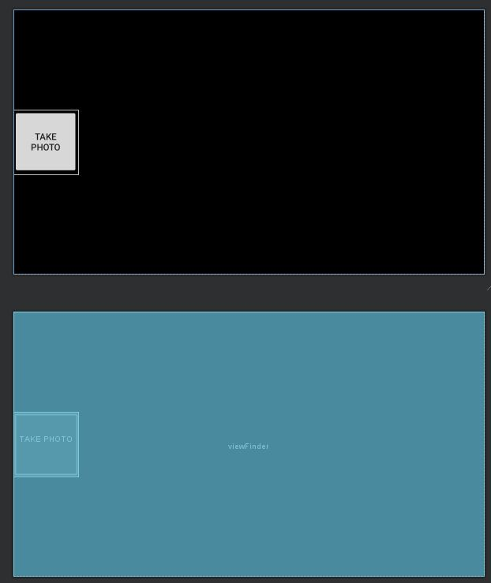

카메라 프리뷰를 위한 코드는 다음을 참조.

[카메라 프리뷰](https://github.com/CallMeDek/android_kotlin_env_project/blob/master/Daily_reports/4.md)

카메라로 사진 찍는 코드는 다음을 참조.

[카메라 캡처](https://github.com/CallMeDek/android_kotlin_env_project/blob/master/Daily_reports/5.md)


```kotlin
private fun takePhoto() {
  ...
  imageCapture.takePicture(
                ContextCompat.getMainExecutor(this@MainActivity), object : ImageCapture.OnImageCapturedCallback(){
                    override fun onError(exception: ImageCaptureException) {
                        Log.e(TAG, "Photo capture failed: ${exception.message}", exception)
                    }

                    override fun onCaptureSuccess(image: ImageProxy) {
                    	val date = Calendar.getInstance().time
                        val formatter = SimpleDateFormat("yyyy_MM_dd_HH_mm_ss", Locale.getDefault())
                        val dateString = formatter.format(date)
                        val fileName = "$dateString.jpg"

                        val buffer = image.planes[0].buffer
                        val size = buffer.remaining()
                        val byteArray = ByteArray(size)
                        buffer.get(byteArray, 0, size)
                        val bitmapImage = BitmapFactory.decodeByteArray(byteArray, 0, byteArray.size)//.rotate(90.0.toFloat())
                        val byteStream = ByteArrayOutputStream()
                        bitmapImage.compress(Bitmap.CompressFormat.JPEG, 100, byteStream)
                        byteStream.close()
                        val rotatedByteArray = byteStream.toByteArray()
                        
                        val b64encoded = Base64.encodeToString(rotatedByteArray, Base64.DEFAULT);
                        
                        val url = Flask서버쪽 URL
                        val stringRequest: StringRequest = object : StringRequest(Method.POST, url,
                            Response.Listener { response ->
                                try {
                                    val fileStream = this@MainActivity.openFileOutput(fileName, Context.MODE_PRIVATE)
                                    bitmapImage.compress(Bitmap.CompressFormat.JPEG, 100, fileStream)
                                    fileStream.close()
                                    bitmapImage.recycle()
                                    val intent = Intent(this@MainActivity, ResultActivity::class.java).apply {
                                        putExtra("image", fileName)
                                        putExtra("result", response)
                                    }
                                    dialog.dismiss()
                                    startActivity(intent)
                                } catch (e: JSONException) {
                                    e.printStackTrace()
                                }
                            },
                            Response.ErrorListener { error ->
                                Toast.makeText(this@MainActivity, error.toString(), Toast.LENGTH_LONG).show()
                            }) {
                            override fun getParams(): Map<String, String> {
                                val params = HashMap<String, String>()
                                params.put("b64", b64encoded)
                                return params.toMap()
                            }
                        }
                        val requestQueue = Volley.newRequestQueue(this@MainActivity)
                        requestQueue.add(stringRequest)

                        image.close()
                    }
}
      
private fun Bitmap.rotate(degrees: Float): Bitmap {
        val matrix = Matrix().apply { postRotate(degrees) }
        return Bitmap.createBitmap(this, 0, 0, width, height, matrix, true)
}
```

```kotlin 
override fun onCaptureSuccess(image: ImageProxy) {} : 이미지가 캡처되었을때 invoke되는 콜백 메소드이다. 캡처된 이미지를 이용해서 후속 처리를 하기 때문에 이 메소드 안에서 프로세스를 진행한다. 
```

```kotlin 
val date = Calendar.getInstance().time
val formatter = SimpleDateFormat("yyyy_MM_dd_HH_mm_ss", Locale.getDefault())
val dateString = formatter.format(date)
val fileName = "$dateString.jpg"

원래는 캡처된 이미지를 바이트 배열 형태로 결과 화면을 보여주는 액티비티로 넘겨 캡처된 이미지를 보여주려고 했는데 인텐트로 들어갈 수 있는 데이터의 용량에 한계가 있어서 날짜 및 시간 이름으로 된 이미지 형태로 저장한 뒤에 이미지의 이름을 넘기는 식으로 구현하기로 했다. 그래서 이미지 이름을 만드는 코드이다. 
```

```kotlin 
val buffer = image.planes[0].buffer : ImageProxy.planes(getPlanes())에는 이미지에 대한 Pixel plane의 배열이 들어 있다. 이때 plane의 숫자는 이미지의 형태에 따라 다르다(이미지 형태는 getFormat()를 참조). 이미지 plane에는 getBuffer라는 메소드가 있다. 이 메소드로 plane에 대한 ByteBuffer를 얻을 수 있다. 
```

```kotlin 
val size = buffer.remaining() : public final int remainint() 메소드로 현재 위치에서 읽어들일 수 있는 데이터의 개수를 리턴한다고 한다. 버퍼안의 데이터의 사이즈를 구해온다. 
```

```kotlin
val byteArray = ByteArray(size) 
buffer.get(byteArray, 0, size)

size만큼의 ByteArray를 만들고 나서 만든 ByteArray에 buffer에서 데이터를 읽어 들여온다. 
```

```kotlin 
val bitmapImage = BitmapFactory.decodeByteArray(byteArray, 0, byteArray.size)//.rotate(90.0.toFloat())

BitmapFactory 클래스에서 decodeByteArray 메소드를 통해서 ByteArray에 있던 데이터를 가져와서 비트맵이미지를 생성한다. 이때 촬영 모드가 Portrait일 경우 이미지가 90도 반 시계 방향으로 회전한 채이므로 이때는 미리 정의해둔 rotate 메소드로 이미지를 회전 시켜준다. Landscape일 경우는 상관 없다. 
```

```kotlin 
val byteStream = ByteArrayOutputStream()
bitmapImage.compress(Bitmap.CompressFormat.JPEG, 100, byteStream)
byteStream.close()
val rotatedByteArray = byteStream.toByteArray()
                        
val b64encoded = Base64.encodeToString(rotatedByteArray, Base64.DEFAULT);

비트맵 이미지를 JPEG 파일 형태로 압축하고 나서 ByteArray를 얻어낸 다음에 Base64 클래스의 encodeToString 메소드로 문자열 형태로 데이터를 인코딩해준다. Flask 서버에서 읽어 들이는 형태를 Base64의 형태로 했었기 때문에 이 과정이 필요하다.
```

```kotlin 
val url = Flask서버쪽 URL : Flask 서버에 미리 추가해둔 라우팅 URL
```

```kotlin 
val stringRequest: StringRequest = object : StringRequest(Method.POST, url,
                            Response.Listener { response ->
                                try {
                                    val fileStream = this@MainActivity.openFileOutput(fileName, Context.MODE_PRIVATE)
                                    bitmapImage.compress(Bitmap.CompressFormat.JPEG, 100, fileStream)
                                    fileStream.close()
                                    bitmapImage.recycle()
                                    val intent = Intent(this@MainActivity, ResultActivity::class.java).apply {
                                        putExtra("image", fileName)
                                        putExtra("result", response)
                                    }
                                    ...
                                    startActivity(intent)
                                } catch (e: JSONException) {
                                    e.printStackTrace()
                                }
                            },
                            Response.ErrorListener { error ->
                                Toast.makeText(this@MainActivity, error.toString(), Toast.LENGTH_LONG).show()
                            }) {
                            override fun getParams(): Map<String, String> {
                                val params = HashMap<String, String>()
                                params.put("b64", b64encoded)
                                return params.toMap()
                            }
                        }

Volley로 수행할 요청을 만드는 코드. 익명의 StringRequest 클래스를 상속받은 클래스로 객체 생성을 하고 이때 Method.POST 방식으로 요청을 보내고 url에 요청을 보낸다. 세번째 생성자 인자로 요청에 관한 콜백 리스너를 생성한다. 구현부에는 오버라이딩된 메소드가 구현되어 있다. 
```

```kotlin 
Response.Listener { response ->
                                try {
                                    val fileStream = this@MainActivity.openFileOutput(fileName, Context.MODE_PRIVATE)
                                    bitmapImage.compress(Bitmap.CompressFormat.JPEG, 100, fileStream)
                                    fileStream.close()
                                    bitmapImage.recycle()
                                    val intent = Intent(this@MainActivity, ResultActivity::class.java).apply {
                                        putExtra("image", fileName)
                                        putExtra("result", response)
                                    }
                                    ...
                                    startActivity(intent)
                                } catch (e: JSONException) {
                                    e.printStackTrace()
                                }
                            },

응답에 대한 리스너의 구현부. openFileOutput으로 이미지 파일을 저장하기 위한 스트림을 생성하고 bitmapImage.compress을 통해 JPEG 형태로 압축한다. Bitmap의 경우 Heap 영역에 할당되어 VM의 Garabage collecting의 대상이 되지 않기 때문에 recyle()을 호출하여 메모리 누수가 일어나지 않게 한다. 
인텐트를 생성하여 파일이름과 Flask 서버로부터의 결과를 키-값 형태로 설정하고 결과 화면 액티비티로 전환 한다. 
```

```kotlin
Response.ErrorListener { error ->
                                Toast.makeText(this@MainActivity, error.toString(), Toast.LENGTH_LONG).show()
                            }) {
                            
에러가 났을때 에러를 Toask 메세지로 띄워준다. 
```

```kotlin 
override fun getParams(): Map<String, String> {
                                val params = HashMap<String, String>()
                                params.put("b64", b64encoded)
                                return params.toMap()
                            }

익명의 StringRequest 클래스를 상속받은 클래스의 구현부에서 override fun getParams(): Map<String, String> 메소드를 오버라이딩한다. 이때 요청에, 캡처한 이미지를 인코딩한 데이터를 보내기 위하여 위와 같이 키-값 형태로 params 객체를 만든다. 
```


